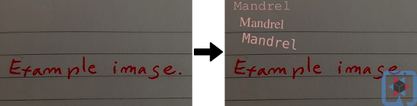

# Serviço da Web para imagens com marca d'água

Este início rápido demonstra um caso de uso para [extensão Quarkus AWT](https://github.com/quarkusio/quarkus/tree/main/extensions/awt).

Há um ponto de extremidade POST único que consome dados de um formulário de várias partes e retorna um fluxo de octetos com uma imagem PNG com marca d'água.
Por uma questão de brevidade, independentemente do tipo de imagem postada, o serviço sempre retorna uma imagem PNG.

[Extensão Quarkus AWT](https://github.com/quarkusio/quarkus/tree/main/extensions/awt) habilita um conjunto de ImageIO e AWT
funcionalidade em imagens nativas do Quarkus. Consulte a documentação e os testes da extensão para conhecer o escopo disponível.
Dada a natureza das bibliotecas nativas no JDK implementando vários algoritmos de processamento de imagem,
aventurar-se fora do escopo testado pode resultar em tempo de construção de imagem nativa ou falha de tempo de execução.

# Additional system dependencies
Note `microdnf` command installing `fontconfig` library in [Dockerfile.jvm](./src/main/docker/Dockerfile.jvm)
and [Dockerfile.legacy-jar](./src/main/docker/Dockerfile.legacy-jar) to support jvm mode. 
Both `freetype` and `fontconfig` libraries are needed for native mode in [Dockerfile.native](./src/main/docker/Dockerfile.native).

# Usage with curl

e.g.

```bash
curl -F "image=@/tmp/my_image.jpg"  http://localhost:8080/watermark --output /tmp/result.png
```
Watermarks the given image with some text in the top left corner and a Quarkus icon in the right bottom corner.

# Usage with a client code

See [ImageResourceTest.java](./src/test/java/org/acme/awt/rest/ImageResourceTest.java). The test is executed
in native mode with:

```bash
./mvnw clean verify -Pnative
```
To run native tests locally, a JDK 11.0.13+ with Mandrel (or GraalVM) 21.3+ is required.
Additionally, `freetype-devel` and `fontconfig` libraries must be installed. 

# What the result looks like

This is an example of what this quick start does to an image:


